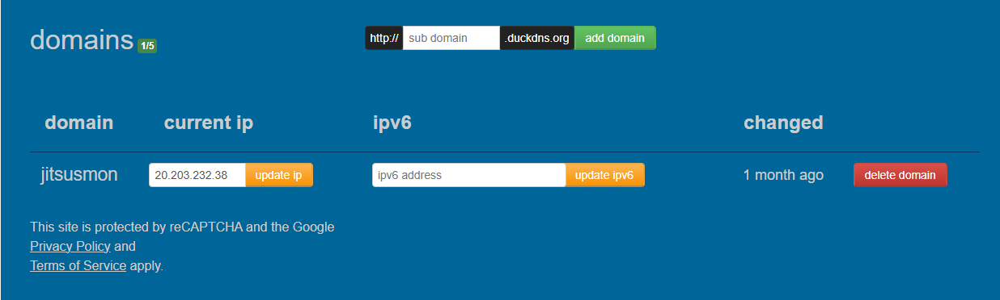

# DAI Practical Work 3 - JitSUSmon - Tchat


## Tables of contents
- [Description](#description)
    - [Main features](#main-features)
    - [Data structure](#data-structure-simplified)
    - [Caching Strategy](#caching-strategy)
    - [HTML page](#html-page)
- [Clone and build](#clone-and-build)
    - [For Linux / MacOS](#for-linux--macos)
    - [For Windows](#for-windows)
- [Docker compose](#docker-compose)
    - [Container registry](#container-registry)
    - [Rebuild image](#rebuild-image)
- [Setup and Usage](#setup-and-usage)
    - [Virtual Machine](#virtual-machine)
    - [Dns Zone](#dns-zone)
    - [Docker compose Usage](#docker-compose-usage)
- [Utilisation IA](#utilisation-ia)
- [Authors](#authors)
- [References](#references)

## Description

**Project name**: JitSUSmon – Chat application

JitSUSmon is a small online chat web application developed as part of a practical engineering course.  
The project focuses on **CRUD operations over HTTP** and on the understanding of how a web API can be designed, documented, deployed and tested using standard tools such as `curl`.

The application exposes an **HTTP/HTTPS API** that allows clients to manage users and messages.

Authentication is handled using a **simple session mechanism based on HTTP cookies**.  
After a successful login, the server sets a `session_id` cookie containing the authenticated user HASH (change every login), which is required to access protected endpoints.

### Main features
- **User management (CRUD)**: create, update, list, retrieve and delete users
- **Message management (CRUD)**: post, edit, list and delete messages
- **Session-based authentication** using a `session_id` cookie (`/login`, `/logout`, `/profile`)
- API designed to be **easy to test with `curl`** and to demonstrate HTTP concepts

### Data structure (simplified)
Below are the only fields the user can manage via the API, other fields (e.g., isAdmin, posted_at, modified_at) are managed internally by the server.:
- **User**: `userId`, `username`, `email`, `password`
- **Message**: `msgId`, `userId`, `content`

The full API specification, including endpoints, request/response formats and example `curl` commands, is available in:
- [`API.md`](./api/API.md)

> [!NOTE]
> This project prioritizes clarity, simplicity and correctness over advanced security mechanisms, in accordance with the **KISS principle** and the educational objectives of the course.

### Caching Strategy

In this project we chose to use a validation model with last modified to implement our caching functionality. Only a GET request on the endpoint `messages` with no query parameter was large enough to warrant caching, as it corresponds to a request for all recorded messages.

### HTML page

For this project, we added an HTML interface with the help of AI to more easily test our function. You can access our HTML interface at this link : [JitSUSmon](https://jitsusmon.duckdns.org/index.html)

## Clone and build
These following instructions will help you to get a copy of the project up and running on your local machine for development and testing purposes.

1. Clone the repository
<div style="display: flex; gap: 20px;">
  <pre><code class="language-bash">
# Clone with SSH
git clone git@github.com:Ischi-Leyre/dai-pw2.git
  </code></pre>

  <pre><code class="language-bash">
# Clone with HTTPS
git clone https://github.com/Ischi-Leyre/dai-pw2.git
  </code></pre>
</div>

2. Navigate to the project directory
~~~bash
cd dai-pw2
~~~

### For Linux / MacOS
Download the dependencies (only for the first time)
~~~bash
./mvnw dependency:go-offline
~~~

Build the project and generate the jar file
~~~bash
./mvnw clean package
~~~

### For Windows
Download the dependencies (only for the first time)
~~~PowerShell
mvnw.cmd dependency:go-offline
~~~

Build the project and generate the jar file
~~~PowerShell
mvnw.cmd clean package
~~~

> [!NOTE]
>
> If you use the IDE IntelliJ, yon can directly run the configuration **make jar file application** to automatic build the project and generate the jar file.

## Docker compose

### Container registry
We published the image used for this project on GitHub Container Registry using the following commands:
```shell
# use token to log in
docker login ghcr.io -u Arnaut
docker tag jitsusmon:latest ghcr.io/ischi-leyre/jitsusmon:latest
docker push ghcr.io/ischi-leyre/jitsusmon:latest
```

You can thus obtain the last updated image from GitHub Container Registry with:
```shell
docker pull ghcr.io/ischi-leyre/jitsusmon:latest
```

### Rebuild image

If you need to rebuild the docker image to update it's app version, you can use the following command from the root of the repo:

```shell
docker build -t jitsusmon:latest .
docker tag jitsusmon:latest ghcr.io/ischi-leyre/jitsusmon:latest
```

## Setup and Usage

### Virtual Machine

This project uses Microsoft Azure VM service to run the servers. You can learn how to install and configure the VM by following the instructions in the practice content section in our ssh and scp course : [VM setup tuto](https://github.com/heig-vd-dai-course/heig-vd-dai-course/tree/main/11.03-ssh-and-scp/01-course-material#install-and-configure-ssh-and-scp)


To launch the servers you must first connect to the vm.

```shell
ssh ubuntu@20.203.232.38

# if you have multiple ssh keys, use this command instead
ssh -i .ssh/<ssh_key_name> ubuntu@20.203.232.38
```
### Dns Zone

We used [duckdns](https://www.duckdns.org/) to claim the domain name for this project. tTo get a domain with duck dns you can simply login and chose a sub domain name (duckdns the default are A/AAAA records).

You can test the DNS resolution with:
```shell
# Test the DNS resolution
nslookup <domain name>
```

Once the DNS record has been created, you need to replace the current IP on DuckDNS with your VM IP. In our case, the final record produced the result below.



### Docker compose Usage

From the Home directory of the VM you can then use the folwing command to launch the programe :

```shell
cd pw3/traefik
docker compose up -d
cd ../api
docker compose up --scale jitsusmon=3 -d
```
> [!NOTE]
>
> If there is a newer version on GitHub Container Registry, go back a few steps to pull the image first.
>
> The certificate request can sometimes take quite a while.

Once the containners are you can access our [traefik dashboard](https://traefik.jitsusmon.duckdns.org) as well as the [chat app](https://jitsusmon.duckdns.org/index.html).


## Utilisation IA
- ChatGPT :
    - Issue template: correction and help for the structure.
    - README: help for the integration HTML code (i.e. footer)
    - Code: generate the Java doc of Class / function.
    - API: proofreading and check with the example given.
    - Main class: help for integretion of ressource with javalin and ObjectMapper configuration.
    - full web page implementation done by AI

- GitHub Copilot:
    - commit: for the commits made in browsers, name and description

- Reverso:
    - spelling, syntax, and reformulation : README, GitHub and comment in code:
        - README
        - GitHub
        - Code: function and block comment

<footer style="padding: 1rem; background-color: rgba(0,0,0,0); border-top: 1px solid rgba(0,0,0,0);">
  <div style="display: flex; justify-content: center; gap: 4rem; flex-wrap: wrap; text-align: center;">
    <div>
    <h3 id="authors">Authors</h3>
    <p>
        <strong>
        <a href="https://github.com/Ischim">Ischi Marc</a>
        </strong>
        <br>
        <strong>
        <a href="https://github.com/Arnaut">Leyre Arnaut</a>
        </strong>
    </p>
    </div>
    <div>
    <h3 id="references">References</h3>
    <p>
        <a href="https://picocli.info/" target="_blank" rel="noopener noreferrer">
            
        </a>
    </p>
    </div>
  </div>

  <div style="margin-top: 1rem;">
    <a href="https://github.com/Ischi-Leyre/dai-pw3-sus-tchat" target="_blank" rel="noopener noreferrer">
        
    </a>
  </div>
</footer>
